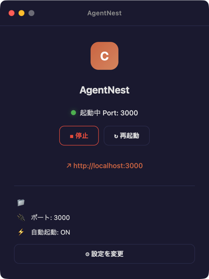
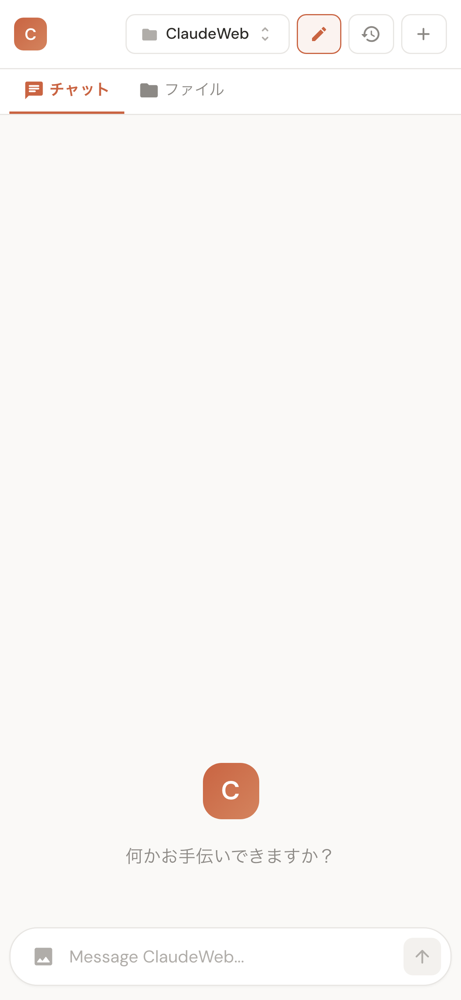
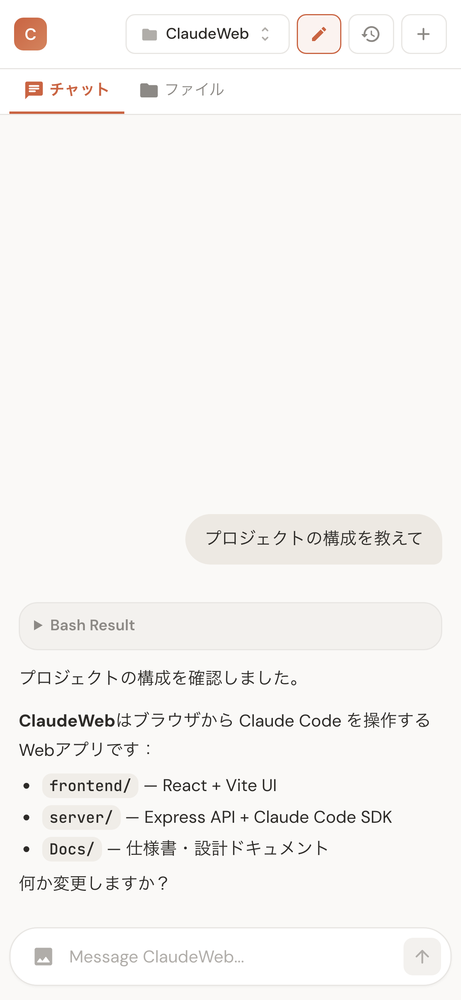
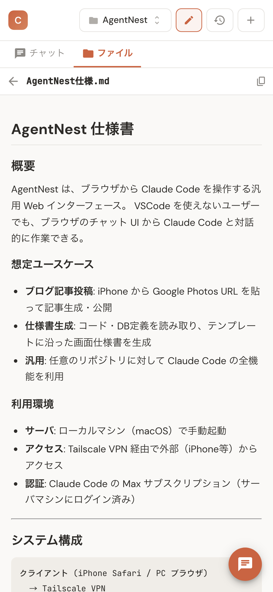

# AgentNest

<p align="center">
  
</p>

ブラウザから Claude Code を操作する Web インターフェース。

開発マシンで起動したサーバに外部からアクセスすることで、iPhone や別の PC のブラウザからリモートの開発マシン上の Claude Code を遠隔操作できます。

Claude Code を介して CLI コマンドの実行や git 操作なども行えるため、
手元に開発環境がなくても外出先からコードの修正・コミット・デプロイといった開発作業が可能です。

ファイルブラウザも内蔵しており、リモートマシン上のコードや画像をブラウザ上で直接閲覧できます。
Tailscale などの VPN 経由でアクセスすれば、ポートをインターネットに公開せず安全に利用できます。

<p align="center">
  
  
  
</p>

## 特徴

- **チャット UI** — Claude Code とリアルタイム対話（SSE ストリーミング）
- **リポジトリ選択** — 複数プロジェクトを切り替えて操作
- **ファイルブラウザ** — コード・Markdown・画像をブラウザ上でプレビュー
- **画像添付** — ペースト / ドラッグ&ドロップで画像を送信
- **権限管理** — ファイル書き込み等の操作を承認/拒否するダイアログ
- **セッション管理** — 会話履歴の保存・再開
- **iPhone 最適化** — キーボード検出・セーフエリア対応のレスポンシブ UI

## 技術スタック

| レイヤー | 技術 |
|---------|------|
| フロントエンド | React 19 + Vite + MUI |
| バックエンド | Express.js + TypeScript |
| AI エンジン | Claude Agent SDK (`@anthropic-ai/claude-agent-sdk`) |
| リアルタイム通信 | Server-Sent Events (SSE) |
| テスト | Playwright |

## インストール

### GitHub Releases からインストール（macOS）

[Releases](https://github.com/Junpeiwada/AgentNest/releases) から DMG をダウンロードしてインストールできます。

Apple Developer 署名がないため、初回起動時に「壊れている」と表示されます。以下のコマンドで解除してください：

```bash
xattr -cr /Applications/AgentNest.app
```

インストール後はアプリ内の「更新を確認」ボタンで自動更新できます（2回目以降はこの操作は不要です）。

## セットアップ

```bash
npm install
cd frontend && npm install && cd ..
cp .env.example .env
# .env を編集して BASE_PROJECT_DIR にプロジェクトディレクトリのパスを設定
```

## 使い方

### 開発モード

```bash
npm run dev
```

サーバ（port 3000）とフロントエンド（port 5173）が同時に起動します。

### プロダクション

```bash
npm run build
npm start
```

### テスト

```bash
npm test           # Playwright E2E テスト
npm run test:ui    # Playwright UI モード
```

## 想定ユースケース

- **ブログ記事投稿** — iPhone から写真 URL を送り、記事を生成・公開
- **仕様書生成** — コードや DB 定義から画面仕様書を自動生成
- **汎用開発** — 任意のリポジトリに対して Claude Code を実行

## 利用環境

ローカルマシン（macOS）でサーバを起動し、Tailscale VPN 経由で外部からアクセスする構成を想定しています。Claude Code の Max サブスクリプションが必要です。

## プロジェクト構成

```
AgentNest/
├── frontend/          # React + Vite UI
│   └── src/
│       ├── components/   # Chat, FileExplorer, Header, etc.
│       └── hooks/        # useChat (SSE + state管理)
├── server/            # Express API
│   ├── routes/           # chat, repos, sessions, files, permission
│   └── claude/           # Claude Code SDK ラッパー
├── tests/             # Playwright E2E テスト
└── Docs/              # 仕様書・設計ドキュメント
```

## ライセンス

[MIT License](LICENSE)
